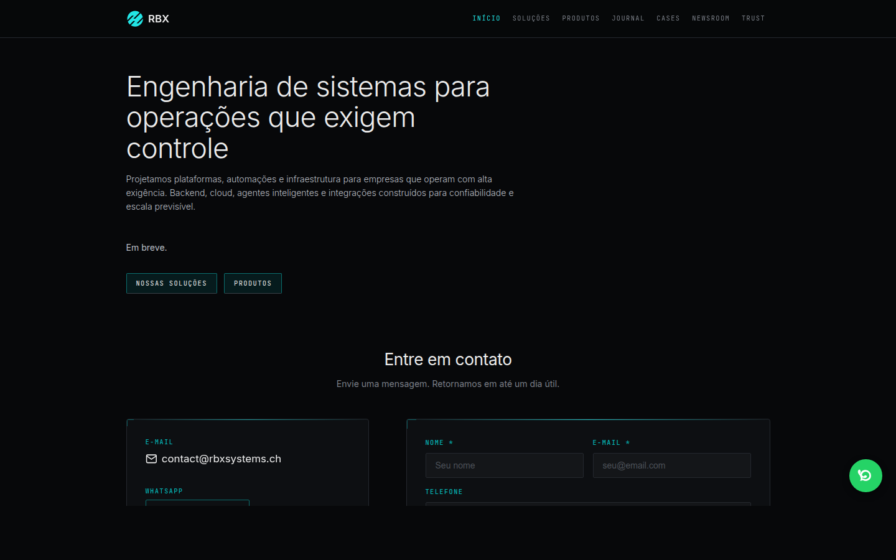
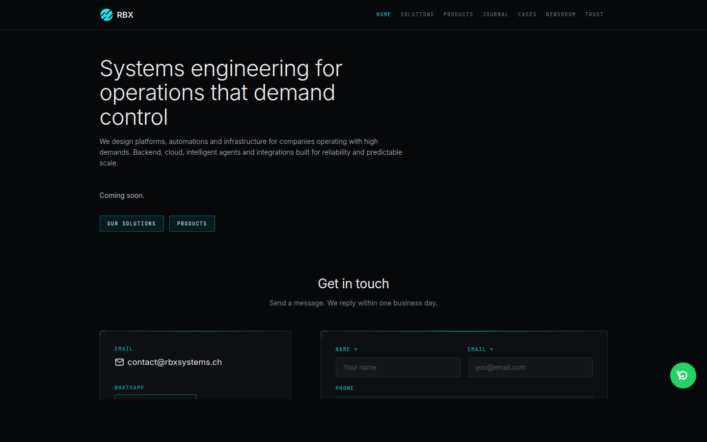

# RBX Site + Comms — Demo para Founders

> Resumo executivo do que está no ar, como acessar e o que mostrar aos outros founders da RBX.

---

## 1. O que entregamos

| Item                                 | Status         | URL                                         |
| ------------------------------------ | -------------- | ------------------------------------------- |
| Site institucional RBX (SvelteKit)   | ✅ No ar       | https://rbx.ia.br                           |
| Site institucional RBX (CH)          | ✅ No ar       | https://rbxsystems.ch                       |
| Formulário de contato                | ✅ Funcionando | Na home de ambos os sites                   |
| Botão flutuante / drawer de WhatsApp | ✅ Funcionando | Canto inferior direito                      |
| Anti-abuse Altcha                    | ✅ Funcionando | Botão customizado (resolve desafio SHA-256) |
| Backend `rbx-comms`                  | ✅ No ar       | https://api.comms.rbxsystems.ch             |
| Console de atendimento (inbox)       | ✅ No ar       | https://comms.rbxsystems.ch                 |

---

## 2. Como o site está no ar

### rbx.ia.br (português)



### rbxsystems.ch (inglês)



## 3. Roteiro de demo (3 minutos)

### 3.1 Site e formulário de contato

1. Abra **https://rbx.ia.br** no navegador.
2. Role até o formulário de contato.
3. Preencha nome, e-mail e mensagem.
4. Clique em **"I'm not a robot"** para resolver o Altcha.
5. Envie o formulário.
6. Mensagem de sucesso deve aparecer:  
   _"Mensagem enviada. Entraremos em contato em breve."_

### 3.2 WhatsApp

1. Clique no botão flutuante de WhatsApp (canto inferior direito).
2. Preencha nome e WhatsApp.
3. Resolva o Altcha e envie.
4. Mensagem de sucesso aparece.

### 3.3 Console de atendimento

1. Abra **https://comms.rbxsystems.ch**.
2. A tela inicial é a **Inbox** — lista de threads.
3. A mensagem enviada pelo site aparece como uma thread do canal **web**.
4. Clique na thread para ver a conversa completa.
5. Use **Reply** para responder por e-mail (ou WhatsApp, se houver telefone).

---

## 4. Evidências técnicas

### Banco de dados

A última mensagem enviada pelo site está persistida na tabela `comms.submissions`:

```
 id                  | created_at                    | name            | email              | source | email_status | whatsapp_status
 --------------------|-------------------------------|-----------------|--------------------|--------|--------------|-----------------
 201859ed-be18-...   | 2026-06-24 18:54:59.866029+02 | Leandro Damasio | ldamasio@gmail.com | site   | pending      | na
```

### Thread no console

- **Thread ID**: `ececfcf7-3b95-4df7-83f3-9388b5131366`
- **Canal**: `web`
- **Contato**: `ldamasio@gmail.com`

### Infraestrutura

- Pods do frontend rodando a imagem `ghcr.io/rbxrobotica/rbx-ia-br:sha-ee1bd0c` em ambos os namespaces.
- CI/CD: merge na `main` → build da imagem → atualização automática do `rbx-infra` → sync do ArgoCD.

---

## 5. URLs importantes

| Propósito              | URL                                                  |
| ---------------------- | ---------------------------------------------------- |
| Site Brasil            | https://rbx.ia.br                                    |
| Site Suíça             | https://rbxsystems.ch                                |
| API de comunicações    | https://api.comms.rbxsystems.ch                      |
| Console de atendimento | https://comms.rbxsystems.ch                          |
| Repositório frontend   | https://github.com/rbxrobotica/rbx-robotica-frontend |
| Repositório backend    | https://github.com/rbxrobotica/rbx-comms             |

---

## 6. O que vem a seguir (sugestões)

- Autenticação no console de atendimento.
- Métricas de conversão no site.
- Templates de resposta rápida no console.
- Integração com CRM/quotation.

---

_Documento gerado em 2026-06-24._
