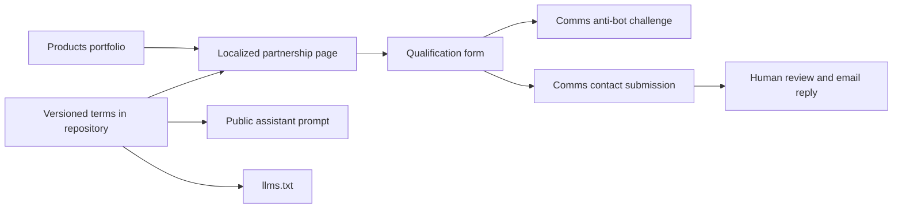

# Engineering Partnership

## Operator decision and public terms

On 2026-10-05, the operator explicitly approved the proposed reference offer:
R$ 8,000 per month for 16 monthly hours of founder-led technical capacity with AI
assistance, initially admitting two partners with a planned ceiling of three.
This decision supersedes the earlier no-public-pricing instruction in
`rbx-growth/marketing/2026-h2-growth/strategy/offers.md` for this frontend offer.
It is a commercial decision, not evidence that the economics or market demand
have already been validated. No changes to that separate repository are made here.

`src/lib/content/partnership.ts` is the versioned frontend source of truth for
price, capacity and localized offer copy. `partnershipTerms` supplies the numeric
terms and version; `formatPartnershipPrice(locale)` formats the same BRL amount
for both locales. The offer page, assistant prompt and `llms.txt` consume that
source. English presentation does not imply a USD or CHF conversion.

The offer covers one product with priorities agreed within the reserved monthly
capacity. Implementation, technical direction, review, testing, communication
and follow-up all consume the same 16 hours. This is not a full-time allocation,
unlimited delivery, a guaranteed completion date or continuous on-call support.
Infrastructure and the client's API consumption have separate budgets.
Additional capacity or support responsibilities require an explicit proposal.

Public terms are a reference for qualification. An RBX person confirms fit,
scope, availability, start date and final commercial conditions. Submitting the
form neither reserves capacity nor creates a contract. The initial two-partner
plan must not appear as a live count of remaining places or fabricated scarcity.

## Capacity and economics

The operator can dedicate at most 20 hours per week across all clients and chose
a conservative planning envelope of 60 hours per month. The plan uses that
explicit monthly envelope rather than multiplying a four-week month:

| Monthly allocation                                  | Hours |
| --------------------------------------------------- | ----: |
| Planned founder availability                        |    60 |
| Reserve for contingencies and commercial management |    12 |
| Maximum committed client capacity                   |    48 |
| One partner                                         |    16 |
| Initial two-partner commitment                      |    32 |
| Planned ceiling of three partners                   |    48 |

The third allocation remains uncommitted while two cycles validate actual
consumption and delivery. AI productivity is not assigned an assumed multiplier.
R$ 500 per hour is an internal planning reference derived from R$ 8,000 / 16;
the public engagement remains the monthly partnership with defined capacity.
Two partners correspond to R$ 16,000 and three to R$ 24,000 in gross monthly
revenue, not profit. Founder remuneration, tax, tools, overhead and variability
still need to be evaluated against real operations, including the two-partner
case rather than relying on permanent full occupancy.

## Page boundaries and qualification

The fit examples include connected products and embedded software as contexts
for assessment, subject to scope review and engineering availability. This is
an editorial addition to the existing product engineering partnership. It does
not change the terms, establish dedicated specialist capacity or promise that
a request will be accepted. The commercial and analytics offer version remains
`2026-10-05`.

The page renders the four localized `partnershipContent.fitCards` in two columns
on desktop and one on mobile. The assistant reads the same English examples;
`llms.txt` derives the localized context titles from that source and retains
human confirmation of scope and availability. The form's existing objective
hint lets visitors optionally name a device platform if known, without adding
fields, payload properties, validation, telemetry or network requests.

`/produtos` and `/products` remain portfolio and implementation evidence pages.
They link to the localized `/parceria` and `/partnership` pages. The offer can
also be shared directly with an already qualified lead. Price, scope and limits
are visible before contact information is requested.

The dedicated page starts an asynchronous process. The visitor provides a short
product context, desired result, timing, contact information and explicit
consent to be contacted about this engineering partnership. The first response
is by email. Consent to qualification is not a newsletter or WhatsApp opt-in.
The form asks visitors not to submit credentials, private source code, customer
records or other sensitive information. It does not upload attachments.

Both localized pages use the `#qualificacao` anchor. The assistant and discovery
index link directly to that section when engineering qualification is the next
step. Aggregate interaction measurement carries no form contents or other PII
and does not automatically join website events with CRM leads. See
[Partnership measurement](partnership-measurement.md) for event boundaries and
how the aggregate evidence can be interpreted.

The submission uses the existing RBX Comms contact contract and identifies the
partnership source and terms in the enquiry. No new CRM, checkout, live capacity
inventory, billing integration or AI decision endpoint is introduced. The
public assistant can explain the approved terms and point to the localized
qualification anchor; it cannot negotiate prices, qualify a lead automatically,
reserve a slot or issue a binding proposal. AI-generated commercial proposals
remain a possible future workflow requiring separate implementation and review.

## Architecture and request budget

The offer renders from the repository with **zero CMS requests**. It replaces
the earlier CMS-backed partnership rendering while keeping the existing public
paths. Existing S3 partnership objects remain untouched and do not supply this
page. A request to `llms.txt` likewise adds no CMS or outbound request.

The form uses one anti-bot challenge GET per verification attempt and one contact
POST only after an explicit, valid user submission. A retry may require another
challenge; there is no automatic contact retry or polling loop. Rendering a page
does not send a lead. The submission surface is disabled while the mutation is
pending, and a synchronous status guard prevents duplicate in-flight submissions.
Errors preserve the entered fields so the visitor can retry intentionally.
Existing API limits and anti-bot enforcement remain the server-side controls.

These are the qualification service requests, separate from the existing site
analytics script and pageview. When analytics is enabled, each emitted offer,
evidence or form event may add one analytics request; submission emits a start
event and then a success or failure event. Event delivery is not awaited and
does not trigger contact submissions. There is no analytics polling or automatic
retry in the new measurement helper. Detailed event counts and deduplication
boundaries are recorded in the measurement document.

The pricing content changes do not add calls to the existing chat endpoint.
Chat retains its one gateway completion and its existing optional bounded RAG
shadow evaluation. The qualification flow does not invoke either service.
The new page adds no application-level database, subscriptions, persistent
browser storage or background jobs for lead data. This frontend is not a
durable queue or an exactly-once delivery mechanism.

| Considered option                             | Benefit                                                                     | Cost or limitation                                                                  | Decision                     |
| --------------------------------------------- | --------------------------------------------------------------------------- | ----------------------------------------------------------------------------------- | ---------------------------- |
| Keep offer inside the product catalog         | One destination                                                             | Mixes detailed commercial terms and form with product evidence                      | Keep only the portfolio link |
| Separate page with repository-versioned terms | Reviewable terms shared with chat and discovery metadata; no CMS dependency | Commercial copy needs a frontend release                                            | Chosen                       |
| Separate page backed by the existing CMS      | Editorial changes without release                                           | Prices can diverge from code, assistant and metadata; CMS failure affects the offer | Replaced for this offer      |
| Use the existing Comms contact API            | Reuses contact delivery and anti-bot controls                               | Human follow-up; no slot reservation or guaranteed exactly-once delivery            | Chosen                       |
| AI pricing and automatic contracting          | More automation                                                             | Requires approved pricing rules, capacity inventory, audit and contract controls    | Outside this implementation  |

The trade-off is deliberate: the implementation prioritizes coherent terms and
a small operational surface over immediate self-service contracting. It leaves
live scheduling, automatic proposals and billing unimplemented. Rollback restores
the previous route loaders and CMS-backed page; the existing CMS objects do not
need restoration. Terms changes should update the version and be reviewed with
the affected page, assistant and metadata together.

## Failure modes

| Dependency or failure                                            | Visible behavior and safe boundary                                                                     | Recovery                                                                                                |
| ---------------------------------------------------------------- | ------------------------------------------------------------------------------------------------------ | ------------------------------------------------------------------------------------------------------- |
| CMS or content storage unavailable                               | The static partnership offer is unaffected; it makes no CMS request                                    | No offer fallback request is required                                                                   |
| Frontend service unavailable                                     | The page cannot load; no lead submission is implied                                                    | Restore the deployed service or roll back to the last reviewed release                                  |
| JavaScript or anti-bot challenge unavailable                     | The offer remains readable; qualification cannot claim success without verification                    | Retry after recovery or use the published email; fields remain disabled without JavaScript              |
| Contact API unavailable, network failure or non-success response | Show submission failure, preserve fields and re-enable the form; no automatic retry                    | Visitor retries intentionally after the service recovers                                                |
| Response lost after the server accepted a submission             | The frontend may show failure although the message reached Comms; exactly-once delivery is not claimed | Human review reconciles repeated enquiries; do not auto-resubmit                                        |
| Comms persistence or downstream email delivery fails             | Receipt by the API is not evidence of human review or delivered email                                  | Existing Comms operational monitoring and recovery own downstream delivery; inspect its delivery status |
| No capacity or need exceeds the reference offer                  | Neither the form nor assistant promises acceptance, a slot or a start date                             | Human reply explains a feasible start, adjusted scope or lack of fit                                    |
| LLM gateway unavailable or model gives an inaccurate answer      | The versioned offer and qualification form remain independent                                          | Consult the page; assistant output is not a binding proposal                                            |
| Analytics disabled, blocked or unavailable                       | Navigation and qualification continue; missing events are not interpreted as missing leads             | Review analytics configuration separately; do not replay contact submissions to recover metrics         |

There is no new financial reconciliation or money movement path in this change.
The form must not report a successful contract, confirmed vacancy or payment.
Server-side durable lead delivery and its operational evidence remain owned by
RBX Comms; this frontend change does not establish or replace its guarantees.

## Validation checklist

- Verify both localized routes, canonicals, language alternates and discovery
  links; keep the same BRL price and 16-hour capacity across all surfaces.
- Confirm catalog CTAs reach the dedicated offer and its qualification anchors.
- Verify explicit consent, field validation, anti-bot gating, successful receipt,
  disabled pending form, double-submit protection and field retention on failure.
- Exercise failures with a local Comms stub; do not send test leads to production.
- Verify request counts: no CMS fetch; bounded challenge and user-triggered POST.
- Inspect desktop and mobile layouts, keyboard navigation and status feedback.
- Run the repository's type, test, SEO, lint, build and security checks. Dependency
  remediation in PR #103 remains a separate prerequisite where applicable.

This checklist specifies required verification; it does not assert a production
deployment, delivered email, approved customer or successful commercial outcome.

## Validation performed on 2026-10-05

A local Vite harness replaced only the anti-bot component with an explicitly
labelled test double and used a loopback Comms stub. No real challenge was solved
and no real lead or email was created. Browser validation confirmed required
consent, a 403 response preserving answers, the whole form disabled during a
delayed response, and a double click producing exactly one POST and one success.
Desktop navigation between portfolio and partnership works in both directions;
390-pixel viewport inspection showed no horizontal overflow. Both host locales
render the same BRL offer and their correct canonical and qualification anchor.
Analytics tests use a mocked provider and do not establish production collection.
